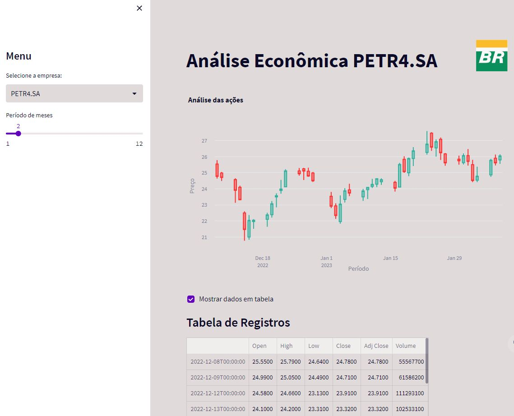

Semana de Eventos - Soluções com Python 2/3
Data Viking - 08/02/2023
https://www.youtube.com/watch?v=zL3HpqV1K-E

------ Instruções ------
pip install virtualenv
python -m venv Ambiente_Virtual
cd Ambiente_Virtual\Scripts
activate
cd ../..
streamlit hello

instalar pacotes que serão usados
streamlit run app.py